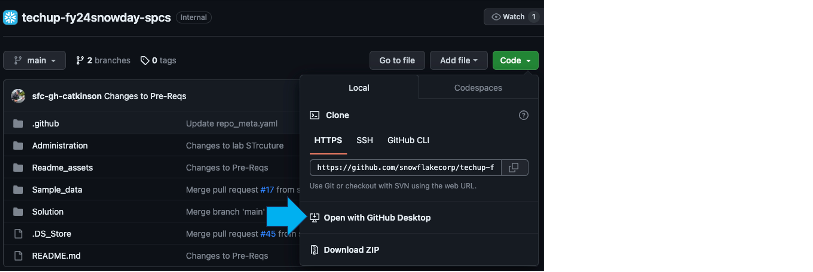

# Advertising Spend and ROI Prediction

The source content for this demo was presented during the [Snowflake Summit Opening Keynote](https://events.snowflake.com/summit/agenda/session/849836). It is built using Snowpark For Python. It has been modified slightly for the purposes of this workshop.

## Overview

In this workshop, we will train a Linear Regression model to predict future ROI (Return On Investment) of variable advertising spend budgets across multiple channels including search, video, social media, and email using Snowpark for Python and scikit-learn.

Workshop highlights:

* Set up VSCode for Snowpark and ML
* Analyze data and perform data engineering tasks using Snowpark DataFrames
* Use open-source Python libraries from the curated Snowflake Anaconda channel (https://repo.anaconda.com/pkgs/snowflake/) with near-zero maintenance or overhead
* Deploy ML model training code on Snowflake using Python Stored Procedure
* Create and register Scalar and Vectorized Python User-Defined Functions (UDFs) for batch inference
* Create Snowflake Task to automate (re)training of the model

## Setup Instructions

### What You'll Need

* You will need the following things before beginning:
    * A Snowflake Account
    * If you've not already done so, install Git on your machine Windows & Mac Instructions | https://www.jcchouinard.com/install-git/
    * Install - [VS Code](https://code.visualstudio.com/) (recommended); as of 25Oct2023 the current version is v1.83.1 (Universal)
    * Install - [Miniconda](https://conda.io/miniconda.html).
    * Install - [Github Desktop](https://desktop.github.com/) (recommended); access GitHub via web browser SSO from Okta Tile; then open GitHub Desktop from there
    * Install - [VSCode Python Extension](https://marketplace.visualstudio.com/items?itemName=ms-python.python); as of 23Oct2023 the current version is v2023.18.0
    * Install - [VScode Python Environment Manager](https://marketplace.visualstudio.com/items?itemName=donjayamanne.python-environment-manager); as of 23Oct2023 the current version is v1.2.4
    * Install - [VScode Snowflake Extension](https://marketplace.visualstudio.com/items?itemName=snowflake.snowflake-vsc); as of 25Oct2023 the current version is v1.3.0

### **Step 1** -- Clone or download repository

* Clone - Clone this repo using [git dekstop](https://github.com/sfc-gh-jgainey/Snowpark_HOL)

### **Step 2** -- Create And Activate Conda Environment using Terminal Window in VS Code
  
* `conda create --name snowpark -c https://repo.anaconda.com/pkgs/snowflake python=3.8`

* `conda activate snowpark`

### **Step 3** -- Install Snowpark for Python and other libraries in Conda environment

* `conda install -c https://repo.anaconda.com/pkgs/snowflake snowflake-snowpark-python pandas notebook scikit-learn cachetools plotly snowflake-ml-python`

* `pip install streamlit`

### **Step 4** -- In VS Code, open [connections.json](connections.json).  Update the Snowflake account details and credentials. Please do not edit the database, schema, role or warehouse that is provided. 

* Note: For the **account** parameter, specify your [account identifier](https://docs.snowflake.com/en/user-guide/admin-account-identifier.html) and do not include the snowflakecomputing.com domain name. Snowflake automatically appends this when creating the connection.

### **Step 5** -- In VS Code, execute the following commmand.
* In a terminal or command prompt, run  `python -m ipykernel install --user --name snowpark --display-name "Python (Snowpark)"`

### **Step 6** -- Confirm your ability to authenticate

* In VS Code, navigate to the [Snowpark_For_Python.ipynb](Snowpark_For_Python.ipynb) notebook and run the "Import Libraries" cell and "Establish Secure Connection to Snowflake" cell.
* Confirm you were able to run both cells with no errors.  If so, you're ready for the Hands-on Lab!  If not, please reach to your account team for help with your errors.
  * Note: Make sure the Jupyter notebook (Python) kernel is set to ***Python (Snowpark)***
